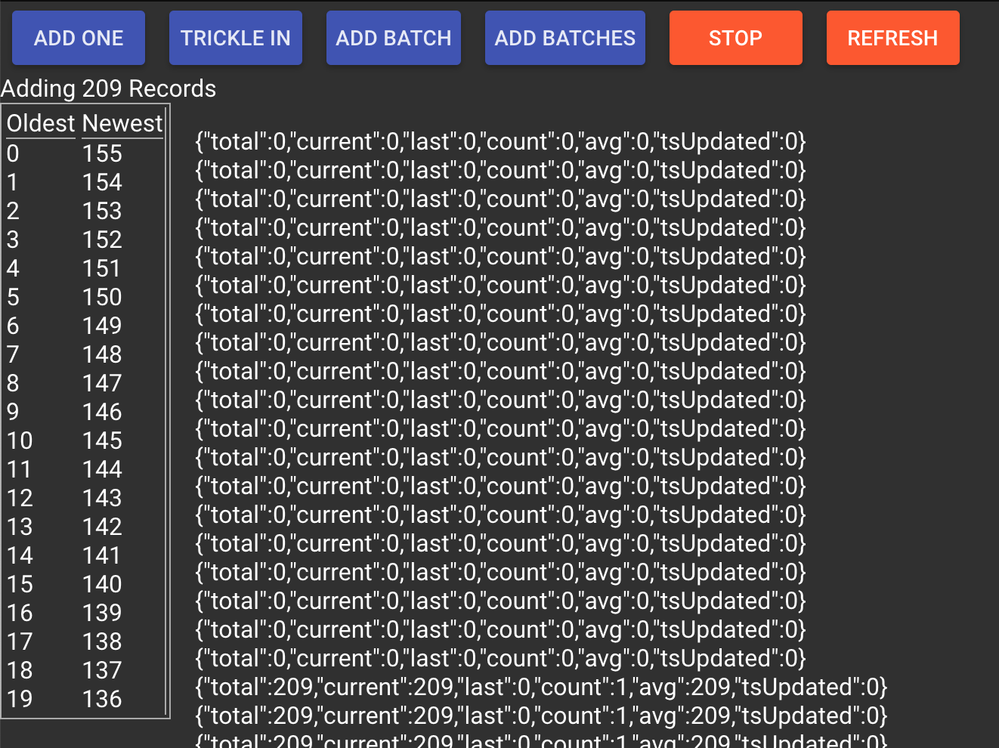

# streambuffer

This is a library to buffer incoming data streams, and trickle them out to the user based on a few options.

## Requirements

1. speed / performance maximize the numebr of records it can handle per second
1. no memory leaks, this will be dealing with a lot of data at a time and be used for 24 hours at a time, small leaks will add up.
1. keep a cache of records
1. have defined views (usually oldest and newest) of records within the buffer
1. When activity comes in bursts, show the data then optinally (if config.stream=true) move the views 1 record at a time to show other data
1. When data comes in regularly just keep the buffer trimmed and show the views for newest and oldest accurately and with is alittle overhead as possible
1. keep very generic stats for the rate of data coming in per second or per interval defined by the user
1. Allow the config to change the interval speed

## get started

## functions

- constructor(objConfig)
- addData(arrData)
- reset()
- setView(objConfig)
- setConfig(objConfig)
- stop()
- go()

## options

- view position
- view size
- cache size
- stream speed records per second

## properties

- config
- stats
- tsFirst
- tsLast
- views
- position
